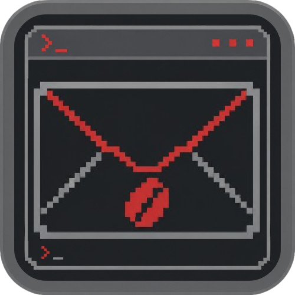
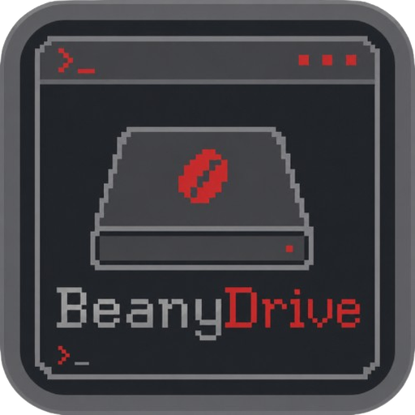

<p align="center">
  
</p>

<h1 align="center">BeanyBundle</h1>

<p align="center">
  
  
  
</p>

<p align="center">
  The terminal-styled home page for all of Greenythebeany's desktop apps —
  a carousel hub linking out to <a href="https://github.com/greenythebeany/BeanyBox">BeanyBox</a>,
  <a href="https://github.com/greenythebeany/BeanyDrive">BeanyDrive</a>, and
  <a href="https://github.com/greenythebeany/Beany-s-Discord-Quest-Maker">Beany's Quest Maker</a>.
</p>

---

Plain static HTML/CSS/JS, no build step — just open `index.html` or host it
with GitHub Pages. Same terminal/cyber design language as the apps it links
to: monospace type, sharp red accent (`#ff5c5c`), dark/light theme, the same
`❯_` chevron prompt motif.

## Features

- **Carousel of apps** — click a card (or a nav dot / arrow / swipe) to open
  its dedicated page
- **Dedicated app pages** — screenshot, feature list, keyboard shortcuts, and
  download/source links for each app
- **Dark / light theme toggle** — defaults to dark, persisted in
  `localStorage`, same CSS variables as the apps themselves
- **English / Slovak language toggle** — defaults to English, persisted in
  `localStorage`
- **Terminal touches** — a boot-sequence intro, blinking cursor, typed hero
  line, CRT scanline overlay, and scroll-reveal animations (all skipped
  automatically under `prefers-reduced-motion`, and the page stays fully
  readable even if JavaScript never loads)

## Hosting on GitHub Pages

1. Push this repo to GitHub (already done if you're reading this on
   GitHub).
2. **Settings → Pages → Build and deployment** → Source: **Deploy from a
   branch** → Branch: `main`, folder `/ (root)` → **Save**.
3. Your site will be live at `https://<username>.github.io/BeanyBundle/`
   within a minute or two.

## Structure

```
index.html              hub page — carousel of apps
apps/
  beanybox.html          BeanyBox detail page
  beanydrive.html        BeanyDrive detail page
  questmaker.html        Beany's Quest Maker detail page
css/style.css            shared styles (design tokens match the apps)
js/main.js                theme, language, boot sequence, carousel, reveal
js/i18n.js                English / Slovak translation strings
assets/icons/             app icons
assets/screenshots/       app screenshots (dark/light where available)
```

## Adding a new app

1. Drop its icon in `assets/icons/` and a screenshot (or two, for dark/light)
   in `assets/screenshots/`.
2. Copy `apps/beanybox.html` as a starting point for the new page.
3. Add translation strings to `js/i18n.js` (English and Slovak).
4. Add a new `.app-card` to the carousel in `index.html`, and cross-link it
   from the "other apps" section on the existing pages.
